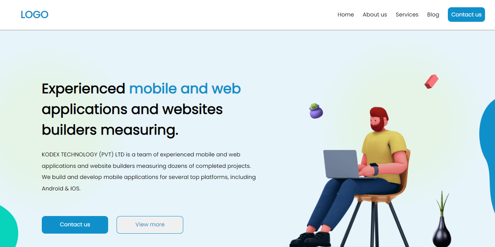
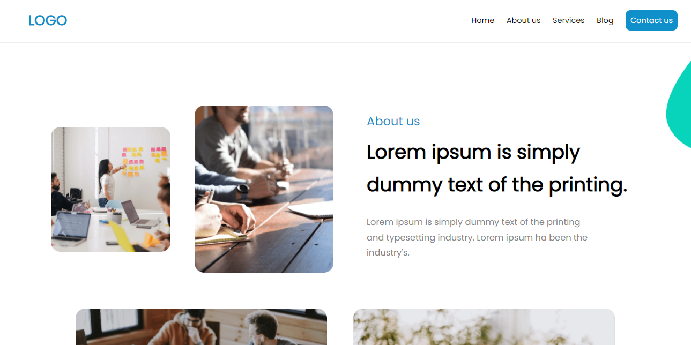

<h1 align="center"><a href="https://gustavo-freita.github.io/Web-page/">Web Page</a></h1>

## Descrição do Projeto:

Esse projeto consiste na quantidade de trabalho que eu consigo fazer com uma página web já feita no Figma. Com isso usando meus conhecimentos proprios sem ajuda de pesquisas para resolver problemas durante a criação da página web.

## Project Description:

This project consists of the amount of work I can do with an already made web page in Figma. With that using my own knowledge without the help of research to solve problems during the creation of the web page.

<h2 align="center">

</h2>

<h3 align="center">
  
  
</h3>

### 🛠 Tecnologias / Technologies

As seguintes ferramentas foram usadas na construção do projeto / The following tools were used in building the project:

- [HTML](https://www.w3schools.com/html/)
- [CSS](https://www.w3schools.com/Css/)
- [Sass](https://sass-lang.com/)
- [Figma](https://www.figma.com/)

<h2>:hammer: Créditos</h2>

Projeto do Figma feito por Sanoj Dilshan / Figma design by Sanoj Dilshan:

<a href="https://www.linkedin.com/in/sanoj-dilshan-ux/">LinkedIn</a> <a href="https://www.figma.com/community/file/1058767686059595687/Agency-Web---Landing-page-design">Figma</a>

Web Page feito por / Web Page made by:

<a href="https://github.com/gustavo-freita">Gustavo Freitas</a> <a href="https://github.com/gustavo-freita">
